# S-DES
## 作业报告
#### 1.基本测试
在本关卡中，我们一共进行了三组测试，我们的输入和输出采用四位十六进制数，输入明文和密钥加密后，在密文框内得到密文，输入密文和密钥解密后，在明文框内得到了相同的明文，该关卡测试通过，以下是测试截图。

第一组加密：

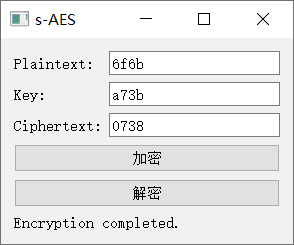

第一组解密：

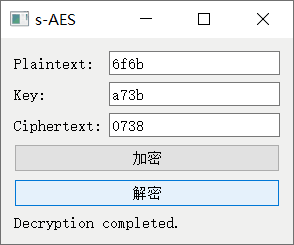

第二组加密：

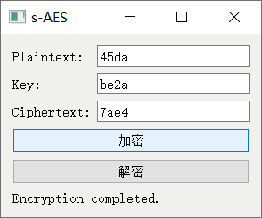

第二组解密：

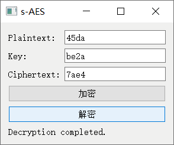

第三组加密：

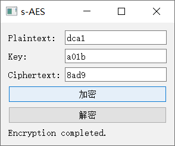

第三组解密：

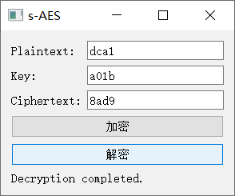

#### 2.交叉测试
在本关卡中，本组与对照组都采用相同的明文和密钥来进行加密操作，观察生成的密文是否相同，效果如下。

本组加密：


对照组加密：


如上图所示，结果有些许差异。

#### 3.扩展功能
在本关卡中，我们输入一个ASCⅡ码字符，然后对其进行加密，将得到的密文再进行解密，得到了输入的ASCⅡ码，本关卡成功，效果如下图。

加密：

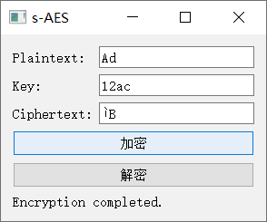

解密：

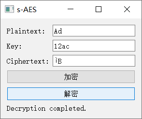

#### 4.多重加密
###### 4.1.双重加密
我们用我们的程序对我们的明文进行两次加密，在第一次加密完成后，换个密钥，再对加密后的密文进行一次加密，该关卡成功通关，以下是效果图：


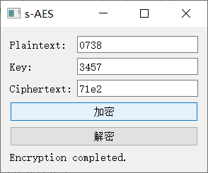

如图所示，明文为6f6b，密文为71e2，密钥为a73b3457。

###### 4.2.中间相遇攻击
我们所用到的函数如下：
```
int ff=0;
        QString plaintext = plaintextEdit->text();
        QString m1;
        QString plaintext2 = plaintextEdit2->text();
        QString m11;
        QString ciphertext = ciphertextEdit->text();
        QString m2;
        QString ciphertext2 = ciphertextEdit2->text();
        QString m22;
        const int size = 65536;
          //unsigned short possibilities[size];

          for (int i = 0; i < size; i++) {
              unsigned short number = static_cast<unsigned short>(i);
              unsigned short a = (number & 0xF000) >> 12;
              unsigned short b = (number & 0x0F00) >> 8;
              unsigned short c = (number & 0x00F0) >> 4;
              unsigned short d = number & 0x000F;

              unsigned short key1 = (a << 12) | (b << 8) | (c << 4) | d;
              encrypt(plaintext, key1,m1);
               encrypt(plaintext2, key1,m11);
              for (int j = 0; j< size; j++) {
                  unsigned short number0 = static_cast<unsigned short>(j);
                  unsigned short a0 = (number0 & 0xF000) >> 12;
                  unsigned short b0 = (number0 & 0x0F00) >> 8;
                  unsigned short c0 = (number0 & 0x00F0) >> 4;
                  unsigned short d0 = number0 & 0x000F;

                  unsigned short key2 = (a0 << 12) | (b0 << 8) | (c0 << 4) | d0;
                  decrypt(ciphertext, key2,m2 );
                  decrypt(ciphertext2, key2,m22 );
                  if(m1==m2 && m11==m22)//&& m11==m22
                  {

                      // 将 key1 和 key2 拆分为四个 4 位的值
                      unsigned short a1 = (key1 & 0xF000) >> 12;
                      unsigned short b1 = (key1 & 0x0F00) >> 8;
                      unsigned short c1 = (key1 & 0x00F0) >> 4;
                      unsigned short d1 = key1 & 0x000F;

                      unsigned short e = (key2 & 0xF000) >> 12;
                      unsigned short f = (key2 & 0x0F00) >> 8;
                      unsigned short g = (key2 & 0x00F0) >> 4;
                      unsigned short h = key2 & 0x000F;

                      // 将拆分后的值转换为 QString
                      QString strKey1 = QString("%1%2%3%4").arg(a1, 0, 16).arg(b1, 0, 16).arg(c1, 0, 16).arg(d1, 0, 16);
                      QString strKey2 = QString("%1%2%3%4").arg(e, 0, 16).arg(f, 0, 16).arg(g, 0, 16).arg(h, 0, 16);
                      qDebug()<<strKey1<<strKey2;
                       statusLabel->setText("结果:"+strKey1+strKey2+"\n");
                            if(ff==0)
                            {
                                ff=1;
                                /;
                            }

                  }
              }
              if(ff==1)
              {
                  ff=0;
                  /;
              }

          }
```

我们首先进行了一组明密文进行破解，出现了很多结果，发现密钥不止一个。我们调用应用程序输出窗口进行观察，在只有一组明密文的时候，计算机缓慢输出很多结果。

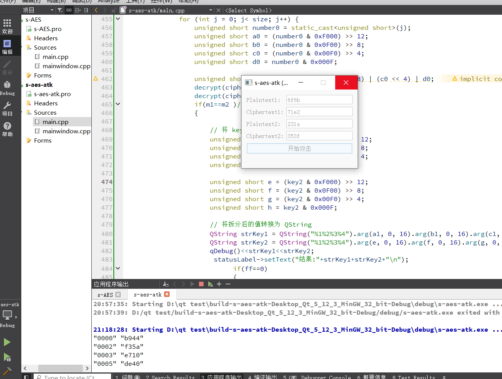

我们进行了两组明密文进行破解，判断 if(m1==m2 && m11==m22)；都满足那么密钥很可能就是这个，设备可能出现问题，最后破解一直没出结果，此处怀疑是因为破解速度过慢，未能输出结果。

###### 4.3.三重加密
在完成双重加密后，换个密钥，再对加密后的密文进行一次加密，该关卡成功通关，以下是效果图：


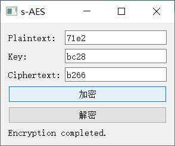

如图所示，明文为6f6b，密文为b266，密钥为a73b3457bc28。

#### 5.工作模式
使用密码分组链（CBC）模式对

## 开发手册
#### 1.加密、解密函数设计
```
// 加密函数
void encrypt(QString plaintext, unsigned short key, QString& ciphertext)
{
    unsigned char nibbles[4];

    // 判断输入是否为两个ASCII码
    if (plaintext.length() == 2) {
        // 将第一个ASCII码转换为nibbles
          convertToNibbles0(plaintext.at(0).unicode(), nibbles);
          // 将第二个ASCII码转换为nibbles
          convertToNibbles0(plaintext.at(1).unicode(), nibbles + 2);
    } else {
        // 输入视为一个16进制字符串，将其转换为unsigned short类型的整数
          unsigned short input = plaintext.toUShort(nullptr, 16);
          // 将该整数转换为nibbles
          convertToNibbles(input, nibbles);

    }

    // 密钥扩展
    unsigned short roundKeys[3];
    expandKey(&key, roundKeys);

    // 轮密钥加
    nibbles[0] ^= (roundKeys[0] >> 12) & 0xF;
    nibbles[1] ^= (roundKeys[0] >> 8) & 0xF;
    nibbles[2] ^= (roundKeys[0] >> 4) & 0xF;
    nibbles[3] ^= roundKeys[0] & 0xF;

    // 轮函数
    substituteNibbles(nibbles, SBox);

    shiftRows(nibbles);

    mixColumns(nibbles, MixMatrix);

    // 轮密钥加
    nibbles[0] ^= (roundKeys[1] >> 12) & 0xF;
    nibbles[1] ^= (roundKeys[1] >> 8) & 0xF;
    nibbles[2] ^= (roundKeys[1] >> 4) & 0xF;
    nibbles[3] ^= roundKeys[1] & 0xF;

    // 轮函数
    substituteNibbles(nibbles, SBox);

    shiftRows(nibbles);
    // 最后一轮密钥加
    nibbles[0] ^= (roundKeys[2] >> 12) & 0xF;
    nibbles[1] ^= (roundKeys[2] >> 8) & 0xF;
    nibbles[2] ^= (roundKeys[2] >> 4) & 0xF;
    nibbles[3] ^= roundKeys[2] & 0xF;
//qDebug()<<nibbles[0]<<nibbles[1]<<nibbles[2]<<nibbles[3];

    if (plaintext.length() == 2) {
        unsigned char asciiCodes[2];
        asciiCodes[0] = combineNibbles(nibbles); // 合并前两个 nibbles
        asciiCodes[1] = combineNibbles(nibbles + 2); // 合并后两个 nibbles

        ciphertext = QString(QChar(asciiCodes[0])) + QString(QChar(asciiCodes[1]));
    } else {// 将 nibbles 转换为十六进制字符串
        QString hexString = QString("%1%2%3%4")
            .arg(nibbles[0], 1, 16)
            .arg(nibbles[1], 1, 16)
            .arg(nibbles[2], 1, 16)
            .arg(nibbles[3], 1, 16);

            ciphertext = hexString;
    }

   // qDebug()<<ciphertext;
}

// 解密函数
void decrypt(QString ciphertext, unsigned short key, QString& plaintext)
{
    unsigned char nibbles[4];
    // 判断输入是否为两个ASCII码
    if (ciphertext.length() == 2) {
        // 将第一个ASCII码转换为nibbles
          convertToNibbles0(ciphertext.at(0).unicode(), nibbles);
          // 将第二个ASCII码转换为nibbles
          convertToNibbles0(ciphertext.at(1).unicode(), nibbles + 2);
    } else {
        // 输入视为一个16进制字符串，将其转换为unsigned short类型的整数
          unsigned short input = ciphertext.toUShort(nullptr, 16);
          // 将该整数转换为nibbles
          convertToNibbles(input, nibbles);

    }

    // 密钥扩展
    unsigned short roundKeys[4];
    expandKey(&key, roundKeys);

    // 最后一轮密钥加
    nibbles[0] ^= (roundKeys[2] >> 12) & 0xF;
    nibbles[1] ^= (roundKeys[2] >> 8) & 0xF;
    nibbles[2] ^= (roundKeys[2] >> 4) & 0xF;
    nibbles[3] ^= roundKeys[2] & 0xF;

    // 逆行位移
    shiftRowsInverse(nibbles);
    // 逆S盒代替
    substituteNibblesInverse(nibbles, InvSBox);

    // 轮函数
    nibbles[0] ^= (roundKeys[1] >> 12) & 0xF;
    nibbles[1] ^= (roundKeys[1] >> 8) & 0xF;
    nibbles[2] ^= (roundKeys[1] >> 4) & 0xF;
    nibbles[3] ^= roundKeys[1] & 0xF;
    mixColumns(nibbles, rMixMatrix);
    shiftRowsInverse(nibbles);
    substituteNibblesInverse(nibbles, InvSBox);


    // 轮密钥加
    nibbles[0] ^= (roundKeys[0] >> 12) & 0xF;
    nibbles[1] ^= (roundKeys[0] >> 8) & 0xF;
    nibbles[2] ^= (roundKeys[0] >> 4) & 0xF;
    nibbles[3] ^= roundKeys[0] & 0xF;

    if (ciphertext.length() == 2) {
        unsigned char asciiCodes[2];
        asciiCodes[0] = combineNibbles(nibbles); // 合并前两个 nibbles
        asciiCodes[1] = combineNibbles(nibbles + 2); // 合并后两个 nibbles

        plaintext = QString(QChar(asciiCodes[0])) + QString(QChar(asciiCodes[1]));
    } else {// 将 nibbles 转换为十六进制字符串
        QString hexString = QString("%1%2%3%4")
            .arg(nibbles[0], 1, 16)
            .arg(nibbles[1], 1, 16)
            .arg(nibbles[2], 1, 16)
            .arg(nibbles[3], 1, 16);
        plaintext = hexString;
    }

}
```

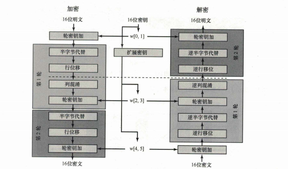

#### 2.密钥扩展函数设计
```
// S-AES密钥扩展函数
void expandKey(const unsigned short* originalKey, unsigned short* roundKeys)
{
    unsigned char keyBytes[2];
    convertToBytes(originalKey[0], keyBytes);
//qDebug()<<originalKey[0]<<keyBytes[0]<<keyBytes[1];
    // 将原始密钥存储在轮密钥中
    roundKeys[0] = originalKey[0];
  //qDebug()<<roundKeys[0];
    // 生成2个额外的轮密钥
    for (int i = 1; i < 3; i++) {
        unsigned char k0;
        g(keyBytes[1],i,&k0);

        keyBytes[0]= keyBytes[0]^k0;

          keyBytes[1]^=keyBytes[0];
        // 生成轮密钥
        quint16 result = (static_cast<quint16>(keyBytes[0]) << 8) | static_cast<quint16>(keyBytes[1]);
         // qDebug()<<(static_cast<quint16>(keyBytes[0]) << 8);

        roundKeys[i] = static_cast<unsigned short>(result);
        //qDebug()<<roundKeys[i];
    }
}
```

其中用得到的相关组件：
```
//g函数
void g(unsigned short input,int i,unsigned char* key )
{
    unsigned char leftHalf = (input >> 4) & 0x0F; // 获取左半部分（高4位）
    unsigned char rightHalf= input & 0x0F; // 获取右半部分（低4位）
    unsigned char result[2];
    result[0] = rightHalf;
    result[1] = leftHalf;

        int row = (leftHalf>> 2) & 0x03;
        int col = leftHalf & 0x03;
       result[1] = SBox[row * 4 + col];
        int row1 = (rightHalf>> 2) & 0x03;
        int col1 = rightHalf & 0x03;
        result[0]  = SBox[row1 * 4 + col1];
    unsigned char byte = ( result[0]  << 4) | result[1]  ;
    byte ^=Rcon[i - 1];
    *key=byte;//qDebug()<<byte;
}

// S盒和逆S盒
const unsigned char SBox[16] = {0x9, 0x4, 0xA, 0xB, 0xD, 0x1, 0x8, 0x5, 0x6, 0x2, 0x0, 0x3, 0xC, 0xE, 0xF, 0x7};
const unsigned char InvSBox[16] = {0xA, 0x5, 0x9, 0xB, 0x1, 0x7, 0x8, 0xF, 0x6, 0x0, 0x2, 0x3, 0xC, 0x4, 0xD, 0xE};
//轮常量
const unsigned char Rcon[10] = {
    0x80, 0x30
};

void convertToBytes(unsigned short value, unsigned char* bytes)
{
    bytes[0] = (value >> 8) & 0xFF;  // 高位字节
    bytes[1] = value & 0xFF;         // 低位字节
}
```

通过以上方法得到第一轮和第二轮加密的扩展密钥。

#### 3.半字节代替函数设计
```
// S盒代替
void substituteNibbles(unsigned char* nibbles, const unsigned char* sBox)
{
    for (int i = 0; i < 4; ++i) {
        int row = (nibbles[i] >> 2) & 0x03;
        int col = nibbles[i] & 0x03;
        nibbles[i] = sBox[row * 4 + col];
    }
}

// 逆S盒代替
void substituteNibblesInverse(unsigned char* nibbles, const unsigned char* invSBox)
{
    for (int i = 0; i < 4; ++i) {
        int row = (nibbles[i] >> 2) & 0x03;
        int col = nibbles[i] & 0x03;
        nibbles[i] = invSBox[row * 4 + col];
    }
}
```

#### 4.行位移函数设计
```
// 行位移
void shiftRows(unsigned char* nibbles)
{
    unsigned char temp = nibbles[1];
    nibbles[1] = nibbles[3];
    nibbles[3] = temp;
}

// 逆行位移
void shiftRowsInverse(unsigned char* nibbles)
{
    unsigned char temp = nibbles[3];
    nibbles[3] = nibbles[1];
    nibbles[1] = temp;
}
```

#### 5.列混淆函数设计
```
// 列混淆
void mixColumns(unsigned char* nibbles, const unsigned char* mixMatrix)
{
    unsigned char result[4];

        result[0] = multiply(mixMatrix[1],nibbles[1])^multiply(mixMatrix[0],nibbles[0]);
        result[1] = multiply(mixMatrix[2], nibbles[0])^multiply(mixMatrix[3],nibbles[1]);
        result[2] = multiply(mixMatrix[0],  nibbles[2]) ^multiply(mixMatrix[1], nibbles[3]);
        result[3] = multiply(mixMatrix[2],nibbles[2]) ^ multiply(mixMatrix[3],nibbles[3]);

    for (int i = 0; i < 4; ++i)
        nibbles[i] = result[i];
}
void convertToNibbles0(unsigned short byte, unsigned char* nibbles)
{
    nibbles[0] = (byte >> 4) & 0xF;
    nibbles[1] = byte & 0xF;
}
unsigned char combineNibbles(unsigned char* nibbles)
{
    unsigned char result = 0;
       for (int i = 0; i < 2; i++) {
           result <<= 4;
           result |= nibbles[i];
       }
       return result;
}
```

以下是相关组件实现：
```
// 列混淆的M矩阵
const unsigned char MixMatrix[4] = {0x1, 0x4, 0x4, 0x1};
const unsigned char rMixMatrix[4] = {0x9, 0x2, 0x2, 0x9};

// TODO 实现x^nfx的函数
void x_de_n_fang_cheng_fx(int xfx[4], int a[4]) //* xfx是结果，a是上一步的结果
{
    //! 注意要取模
    //! 既约多项式是 x^4 + x + 1
    //* 保存四次乘法的系数
    if (a[0] == 0)
    {
        for (int i = 0; i < 3; i++)
            xfx[i] = a[i + 1];
    }
    else
    {
        //! 如果乘数首项不为1就需要将 b1x^2+b0x 与 x+1 进行异或
        xfx[1] = a[2];
        xfx[2] = a[3] == 1 ? 0 : 1;
        xfx[3] = 1;
    }
}
// TODO 乘法
int* chengfa(int a[4], int b[4])
{
    //* 储存结果的系数
    int* result = new int[4];
    for (int i = 0; i < 4; i++)
        result[i] = 0;

    //* 记录下x^nfx
    int xfx[4] = { 0 };
    x_de_n_fang_cheng_fx(xfx, a);
    int x2fx[4] = { 0 };
    x_de_n_fang_cheng_fx(x2fx, xfx);
    int x3fx[4] = { 0 };
    x_de_n_fang_cheng_fx(x3fx, x2fx);

    //* 现在需要根据多项式a和b开始异或
    if (b[0] == 1)
        for (int i = 0; i < 4; i++)
            result[i] ^= x3fx[i];
    if (b[1] == 1)
        for (int i = 0; i < 4; i++)
            result[i] ^= x2fx[i];
    if (b[2] == 1)
        for (int i = 0; i < 4; i++)
            result[i] ^= xfx[i];
    if (b[3] == 1)
        for (int i = 0; i < 4; i++)
            result[i] ^= a[i];

    //qDebug()<<result[0]<<result[1]<<result[2]<<result[3]<<"zhongj";
    return result;
}

void reverseArray(int arr[], int n)
{
    for (int i = 0; i < n / 2; i++) {
        qSwap(arr[i], arr[n - 1 - i]);
    }
}
// 将两个 4 位二进制字符相乘，返回结果的 unsigned char
unsigned char multiply(unsigned char a, unsigned char b) {
    // 将输入的二进制字符转换为 QBitArray
    QBitArray bitsA(4);
    for (int i = 0; i <4; i++) {
        bitsA.setBit(i, (a & (1 << i)) != 0);
    }
    QBitArray bitsB(4);
    for (int i = 0; i <4; i++) {
        bitsB.setBit(i, (b & (1 << i)) != 0);
    }

    // 将 QBitArray 转换为 int 数组
    int arrA[4] = { 0 };
    for (int i = 0; i < 4; i++) {
        arrA[i] = bitsA.at(i);
        //qDebug()<< arrA[i]<<"A";
    }
    int arrB[4] = { 0 };
    for (int i = 0; i < 4; i++) {
        arrB[i] = bitsB.at(i);

    }
    reverseArray(arrA, 4);
     reverseArray(arrB, 4);
     for (int i = 0; i < 4; i++) {
        // qDebug()<< arrA[i]<<"A"<<arrB[i]<<"B";

     }
    // 调用上述代码中的乘法函数进行计算
    int* arrResult = chengfa(arrA, arrB);

    // 将计算结果的 int 数组转换为 QBitArray
    QBitArray bitsResult(4);
    for (int i = 0; i < 4; i++) {
        bitsResult.setBit(i, arrResult[i]);
    }
    for (int i = 0; i <  2; i++) {
           bool temp = bitsResult.at(i);
           bitsResult.setBit(i, bitsResult.at(3 - i));
          bitsResult.setBit(3 - i, temp);
       }
    delete[] arrResult;

    // 将计算结果的 QBitArray 转换为 unsigned char
    unsigned char result = 0;
    for (int i = 0; i < 4; i++) {
        if (bitsResult.testBit(i)) {
            result |= (1 << i);
        }
    }
//qDebug()<<result;
    return result;
}
```

#### 6.主程序函数及GUI设计
创建GUI窗口：
```
int main(int argc, char *argv[])
{
    QApplication a(argc, argv);

    QWidget window;
    QVBoxLayout* layout = new QVBoxLayout(&window);

    QFormLayout* formLayout = new QFormLayout();
    QLineEdit* plaintextEdit = new QLineEdit();
    QLineEdit* keyEdit = new QLineEdit();
    QLineEdit* ciphertextEdit = new QLineEdit();
    formLayout->addRow("Plaintext:", plaintextEdit);
    formLayout->addRow("Key:", keyEdit);
    formLayout->addRow("Ciphertext:", ciphertextEdit);
    layout->addLayout(formLayout);

    QPushButton* encryptButton = new QPushButton("加密");
    QPushButton* decryptButton = new QPushButton("解密");
    layout->addWidget(encryptButton);
    layout->addWidget(decryptButton);

    QLabel* statusLabel = new QLabel();
    layout->addWidget(statusLabel);

    QObject::connect(encryptButton, &QPushButton::clicked, [&]() {
        bool ok;
        QString plaintext = plaintextEdit->text();
        unsigned short key = keyEdit->text().toUShort(&ok, 16);
        QString ciphertext;

        encrypt(plaintext, key, ciphertext);

        ciphertextEdit->setText( ciphertext);
        statusLabel->setText("Encryption completed.");
    });

    QObject::connect(decryptButton, &QPushButton::clicked, [&]() {
        bool ok;
        QString ciphertext = ciphertextEdit->text();
        unsigned short key = keyEdit->text().toUShort(&ok, 16);
        QString plaintext;

        decrypt(ciphertext, key, plaintext);

       plaintextEdit->setText( plaintext);
        statusLabel->setText("Decryption completed.");
    });

    window.show();

    return a.exec();
}
```

## 用户指南
欢迎使用我们设计的S-AES加解密建议GUI，这个工具可以帮助您进行Simplified Advanced Encryption Standard (S-AES) 加密和解密操作。请按照以下步骤进行操作：

#### 安装与启动：

1.下载S-AES加解密代码。

2.启动程序后，您将看到主界面。

#### 操作流程：
1.打开S-AES加密/解密程序界面。

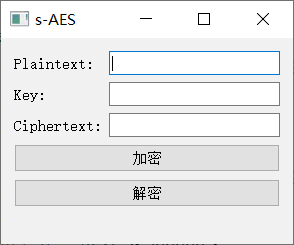

2.在第一行输入框中，输入4位s十六进制的明文。

3.在第二行输入框中，输入4位十六进制的密钥。

4.点击"加密"按钮，程序将会使用S-AES算法对明文进行加密。

5.在下方的输入框中，将显示出加密后的4位密文。请复制或记下该密文以备解密操作使用。

加密界面：


解密过程：

1.在第三行输入框中，输入要解密的4位密文。

2.在第二行输入框中，输入之前用于加密的4位密钥。

3.点击"解密"按钮，程序将会使用S-AES算法对密文进行解密。

4.在上方的输入框中，将显示出解密后的明文。

解密界面：


#### 注意事项：
确保您妥善保管加密和解密密钥，以防止数据丢失。

请勿忘记加密和解密时所使用的密钥。密钥丢失将导致文件无法访问

遵守数据保护法规和隐私政策，确保只加密和解密您有权访问的文件。

这是一个简单的S-AES加解密GUI用户指南，可以帮助用户了解如何使用该工具进行加密和解密操作。如果用户需要更多详细信息或遇到问题，请通过下面方式咨询作者。

#### 联系作者：
QQ：1322877041  QQ：3230506757
